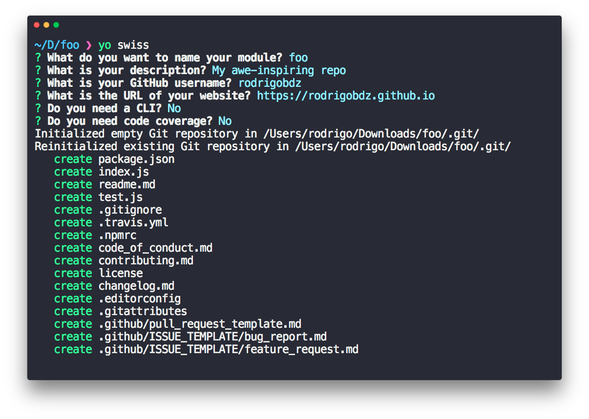

# generator-swiss [](https://travis-ci.com/rodrigobdz/generator-swiss)

> The Swiss Army Knife of Yeoman generators

<!-- markdownlint-disable MD001 -->
### Features
<!-- markdownlint-enable MD001 -->

- npm module generator - `yo swiss`
- Changelog generator with [Keep a Changelog](https://keepachangelog.com/en/1.0.0) format - `yo swiss:changelog`
- [GitHub's recommended files](https://github.com/rodrigobdz/generator-swiss/community) for Open Source repositories  - `yo swiss:github`
- [Minimal Readme](https://github.com/rodrigobdz/minimal-readme) generator - `yo swiss:readme`
- Shell script generator following [Google's Shell Style Guide](https://google.github.io/styleguide/shell.xml) - `yo swiss:script`

This is what I use for [my own modules](https://www.npmjs.com/~rodrigobdz) and [repositories](https://github.com/rodrigobdz?tab=repositories).

<!-- markdownlint-disable MD033 -->

<!-- markdownlint-enable MD033 -->

## Install

```sh
npm install --global yo generator-swiss
```

## Usage

With [yo](https://github.com/yeoman/yo):

```sh
yo swiss
```

There are multiple command-line options available:

```sh
$ yo swiss --help

  Usage:
  yo swiss:app [options]

  Options:
    -h,   --help           # Print the generator's options and usage
          --skip-cache     # Do not remember prompt answers                    Default: false
          --skip-install   # Do not automatically install dependencies         Default: false
          --force-install  # Fail on install dependencies error                Default: false
          --cli            # Add a CLI
          --coverage       # Add code coverage with nyc
          --codecov        # Upload coverage to codecov.io (implies coverage)
```

### Generators

```sh
yo --generators

Available Generators:

  swiss
    changelog
    github
    minimal-readme
    sh
```

## Related projects

- [minimal-readme](https://github.com/rodrigobdz/minimal-readme) - Clean readme template.

## License

[MIT](license) © [rodrigobdz](https://rodrigobdz.github.io)
